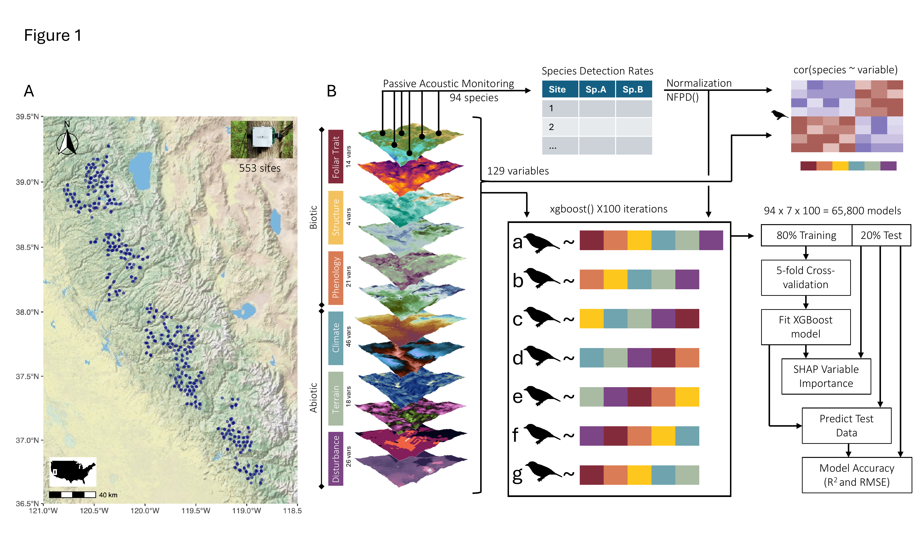

# Trait Importance

This repository contains code to accompany the manuscript titled **The predictive power of new remote sensing data for biological distributions**

The goal of this project is to quantify the extent to which new remote sensing data 
like hyperspectrally derived foliar traits and GEDI lidar improve our ability to 
model species distributions and relative abundances.
A dataset of 129 remote sensing variables was used to predict the relative abundances of 94 bird species. 
We compared the accuracy of species models with and without different predictor variables to see how those predictors improved model accuracy.

# Data Availability

All of the derived datasets used in this project are available within this repository inside the "data" folder.
Most files are available in both csv and rds formats.

Complete raster data of all 129 geospatial variables would never fit on GitHub, but luckily all of these are publicly available anyway. 
You can check in "TableS1_Biocube_var_description" for the links to the original datasets.

| File Name | Description |
|-----------|-------------|
| siteDetections_foliarTraits_BioCube | The core dataset. One row per study site. Columns for each species and geospatial variable. |
| TableS1_Biocube_var_description | One row for each geospatial variable. Columns for variable descriptions, DOI of original publication, and link to dataset. |
| xgb_modelParameters | xgboost outputs for each species. 100 iterations per species per model type. Model R2 and RMSE |
| shift_sample_traits_cleaned4Laura | Measured foliar traits from the SHIFT campaign, used for the Figure 5 boxplots. |
| TRY_data_20251208 | Raw TRY database export (request 45681), used for the Figure 5 boxplots. |

### One large file must be regenerated

`xgb_variableImportance` is too large for GitHub (over 500 MB per file), so it is not
included here. It is an output of the modelling step, so you can recreate it by running
`xgboost.R`, which writes both the `.rds` and `.csv` versions into the "data" folder.
Do this before running `Figure4.R` or `SHAPimpSp.R`, which are the only scripts that read it.

Intermediate files produced partway through the pipeline are kept locally in
"data/intermediate_steps" and are not tracked, since every one of them can be
regenerated by running the pipeline from the files above.

# Code

All relevant code is available in the 'code' folder. The scripts here start from 
publicly available raster data and show all steps of data cleaning, processing, all the way to the final
figure visualizations.

Additional code in the folder 'code/deprecated code' describes methods explored in earlier iterations of the project but not used in final analyses.

| File Name | Description |
|-----------|-------------|
| full_protocol.R | The full data processing, analysis and visualization pipeline. Start to finish. |
| dataProcessing.R | Just the first section of the pipeline. Data extraction, cleaning, and formatting. |
| xgboost.R | The second section of the pipeline. Calculating relative abundance models with xgboost. |
| correlations.R | Code to generate Figure 2 - the correlation matrix |
| Figure3.R | Code to generate Figure 3 - paired t-tests for test R2 |
| Figure4.R | Code to generate Figure 4 - stacked bar chart of SHAP importance |
| TRY_SHIFT.R | Code to generate the boxplots in Figure 5 |
| singleSpSHAP | Code to generate SHAP plots in Figure 5 |
| SHAPimpSP.R | Code to generate supplemental figures |

